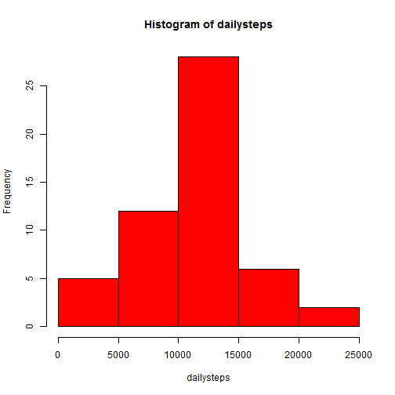
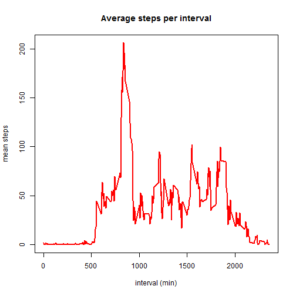
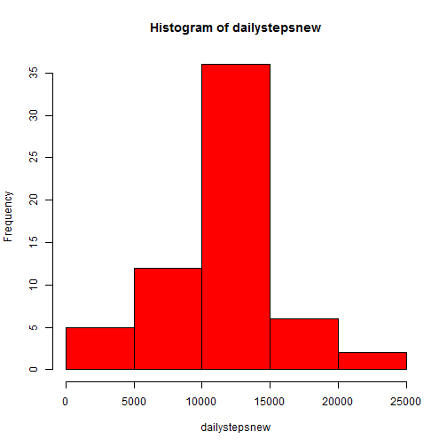
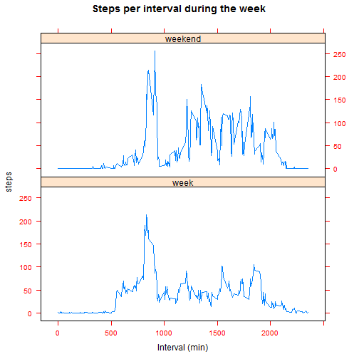

### downloading, unzipping and processing data needed to generate figures  
- Check if data is present in directory  
- If not: open file from [coursera website](https://d396qusza40orc.cloudfront.net/repdata%2Fdata%2Factivity.zip)  
- Unzip file and save to dat1 df  
- Check data and change date variable to class: date


```r
File<- "activity.csv"
temp <- tempfile()
setInternet2(use = TRUE)

#check if file exists, if not download and unzip
if (file.exists(File)){
        print("file_present_in_directory")
        dat1 <- read.csv("activity.csv",sep=",", header=T)
        } else {
                download.file("https://d396qusza40orc.cloudfront.net/repdata%2Fdata%2Factivity.zip", temp, mode="wb")
                unzip(temp, "activity.csv")
                dat1 <- read.csv("activity.csv", sep=",", header=T)
                unlink(temp)
                }
```

```
## [1] "file_present_in_directory"
```

```r
#check df and change date var to class date
dat1$date <- as.Date(as.character(dat1$date), "%Y-%m-%d")
# check df
str(dat1)
```

```
## 'data.frame':	17568 obs. of  3 variables:
##  $ steps   : int  NA NA NA NA NA NA NA NA NA NA ...
##  $ date    : Date, format: "2012-10-01" "2012-10-01" ...
##  $ interval: int  0 5 10 15 20 25 30 35 40 45 ...
```

```r
summary(dat1$steps)
```

```
##    Min. 1st Qu.  Median    Mean 3rd Qu.    Max.    NA's 
##    0.00    0.00    0.00   37.38   12.00  806.00    2304
```

```r
summary(dat1$date)
```

```
##         Min.      1st Qu.       Median         Mean      3rd Qu. 
## "2012-10-01" "2012-10-16" "2012-10-31" "2012-10-31" "2012-11-15" 
##         Max. 
## "2012-11-30"
```

```r
summary(dat1$interval)
```

```
##    Min. 1st Qu.  Median    Mean 3rd Qu.    Max. 
##     0.0   588.8  1178.0  1178.0  1766.0  2355.0
```

### What is mean total number of steps taken per day?  
- Calculate total number of steps taken per day and ignore missing values.  
- Generate a histogram of the total steps per day  
- Calculate mean and median of the total steps per day


```r
# subset date with aggregate and calculate the total steps per date 
totalday <- with(dat1, aggregate(steps ~ date, FUN = sum, na.rm=F, na.action= na.pass))
# generate histogram
dailysteps <- totalday$steps
hist(dailysteps, breaks=5, col="red")
```

 

Mean and median total steps per day

```r
mean(dailysteps, na.rm=T)
```

```
## [1] 10766.19
```

```r
median(dailysteps, na.rm=T)
```

```
## [1] 10765
```

**The mean and median are slightly different**  

### What is the average daily activity pattern?  
- Make time series plot of 5min interval and average number of steps across all days  
- Which average time interval contains maximum number of steps  


```r
#subset data by steps and interval and calculate the mean.
totalact <- with(dat1, aggregate(steps ~ interval, FUN = mean, na.rm=TRUE, na.action= NULL))
# Generate lineplot of the interval mean across all days and print maximum step interval
plot(totalact$interval, totalact$steps, type="l", col="red", lwd=2, 
     xlab="interval (min)", ylab="mean steps",main = "Average steps per interval")
```

 

```r
maxact <- totalact[(which.max(totalact$steps)),1]
print (maxact)
```

```
## [1] 835
```

**Interval 835 contains the maximum steps**  

### Imputing missing vaulues.  
- Calculate total number of missing values in df  
- Fill in the missing values by using the average daily interval calculated before  
- Create a new dataset without missing values
- Make a histogram of the new dataset and calculate the mean and median. Do these values differ? 

```r
# Calculate total number of rows with NA
length(which(is.na(dat1)))
```

```
## [1] 2304
```

```r
# Replace NA's with average interval over all days calculated before. Use a for loop and change all NA to the average value of that interval for all days together. Save in a new df: dfNArep1
dfNArepl <- dat1
for(i in 1:nrow(dfNArepl)){
        if (is.na(dfNArepl$steps[i])){
                IntID2<- which(dfNArepl$interval[i] == totalact$interval)
                dfNArepl$steps[i]<- totalact$steps[IntID2]
        }
}

# Subset new df with aggregate and calculate again the total number of steps per day.
totaldaynew <- with(dfNArepl, aggregate(steps ~ date, FUN = sum, na.rm=FALSE, na.action= na.pass))
# Generate a new histogram of the new data
dailystepsnew <- totaldaynew$steps
hist(dailystepsnew, breaks=5, col="red")
```

 

```r
#Calculate mean total daily steps
mean(dailystepsnew, na.rm=T)
```

```
## [1] 10766.19
```

```r
#Calculate median total daily steps
median(dailystepsnew, na.rm=T)
```

```
## [1] 10766.19
```

**As expected the means remain the same because the means were used to fill in the missing values. Therefore the median is now closer to the mean.**  

### Are there differences in activity patterns between weekdays and weekends?  
- Create a new factor variable in the dataset with two levels: week and weekend  
- Make a panel plot of the interval and average number of steps taken, averaged across all week and weekend days  


```r
#Add extra column to df with day of the week named day
dfNArepl$day <- weekdays(dfNArepl$date)
#Add extra column to df with week or weekend
dfNArepl$week <- dfNArepl$day
#Use a for loop to check for the name of the day: If its a Saturday or Sunday change to weekend, ifnot change to week
for (i in 1:nrow(dfNArepl)){
        ifelse (dfNArepl$week[i] == "zaterdag"|| dfNArepl$week =="zondag",
                (dfNArepl$week[i] <- "weekend"), (dfNArepl$week[i] <- "week"))
}

#subset for mean steps per interval and week or weekend
totalweek <- with(dfNArepl, aggregate(steps ~ interval+week, FUN = mean, na.rm=FALSE, na.action= na.pass))
```


```r
#plot with lattice plotting mean steps in week and weekend
xyplot(steps ~interval|week, scales=list(cex=.8, col="red"),
       data = totalweek,
       type="l",
       main="Steps per interval during the week",
       xlab="Interval (min)", 
       layout=c(1,2))
```

 

**Activity in the weekend is a bit higher. The time of max activity doesn't change a lot between the week and weekend**  


